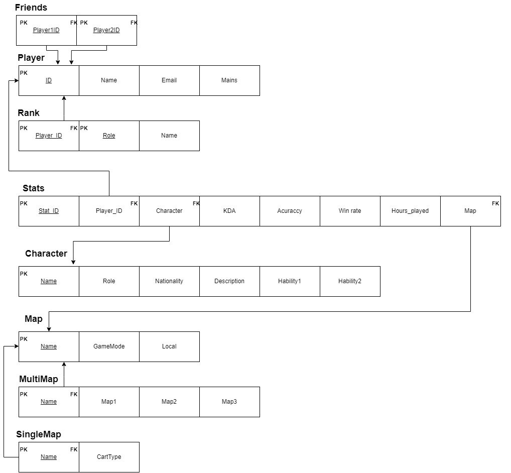

# BD: Trabalho Prático APFE

**Grupo**: P2G5
- Alberto Oliveira, MEC: 98445
- Eduarda Tavares, MEC: 98447

## Introdução / Introduction

O nosso projeto assenta na criação de uma base de dados que consiga armazenar estatísticas do jogo "OverWatch" por utilizador, assim como o seu "rank" para cada papel desempenhado. Para além disto, constam também da nossa base de dados os personagens e mapas que constituem o jogo.

## ​Análise de Requisitos / Requirements

Através do nosso sistema, os utilizadores deverão ser capazes de:
- Verificar as estatísticas (e.g. precisão de arma, taxa de vitória, horas jogadas, KDA) de um jogador, assim como a personagem no qual tem mais horas de jogo, efetuando a pesquisa através do seu ID único;
- Pesquisar através do ID do jogador para descobrir o seu rank respetivo de cada um dos quatro possíveis papéis desempenhados: tank, damage, suporte ou flex;
- Pesquisar personagens por papel, nacionalidade ou habilidades;
- Verificar o modo de jogo associado a um mapa, onde este se localiza e se é um mapa com múltiplas instâncias ou apenas uma;

## DER

## ER

