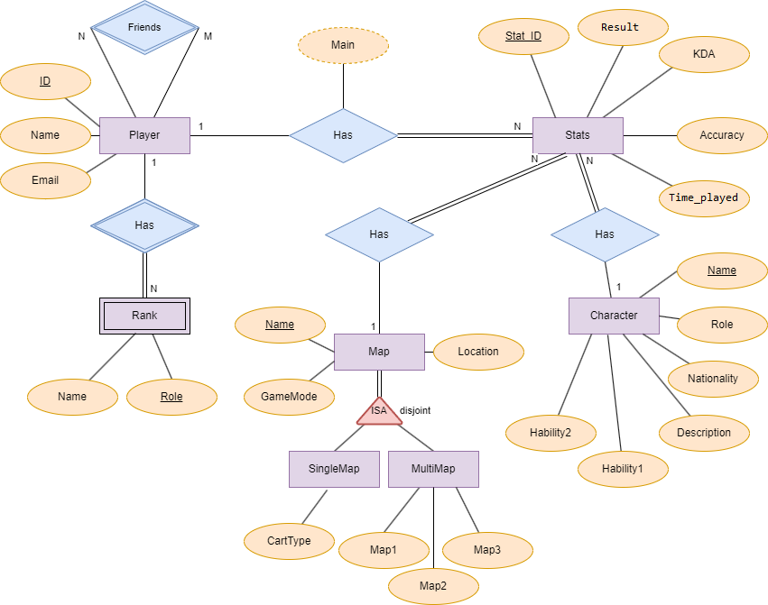
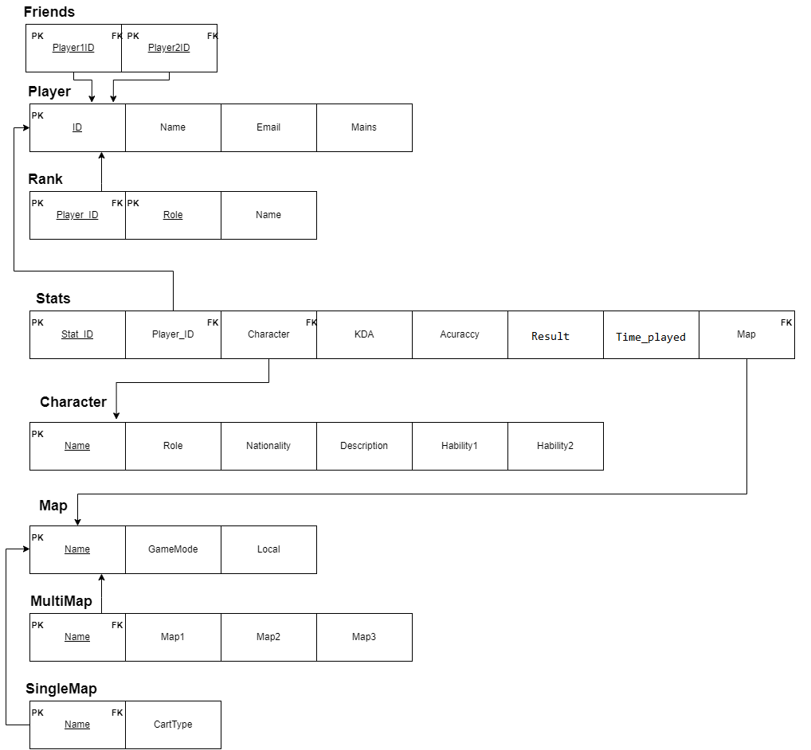

# BD: Trabalho Prático APF-T

**Grupo**: P2G5
- Alberto Oliveira, MEC: 98445
- Eduarda Tavares, MEC: 98447

# Instructions - TO REMOVE

Este template é flexível.
É sugerido seguir a estrutura, links de ficheiros e imagens, mas adicione ou remova conteúdo sempre que achar necessário.

---

This template is flexible.
It is suggested to follow the structure, file links and images but add more content where necessary.

The files should be organized with the following nomenclature:

- sql\01_ddl.sql: mandatory for DDL
- sql\02_sp_functions.sql: mandatory for Store Procedure, Functions,... 
- sql\03_triggers.sql: mandatory for triggers
- sql\04_db_init.sql: scripts to init the database (i.e. inserts etc.)
- sql\05_any_other_matter.sql: any other scripts.

Por favor remova esta secção antes de submeter.

Please remove this section before submitting.

## Introdução / Introduction


O nosso projeto assenta na criação de uma base de dados capaz de armazenar informação relativa a um videojogo -  "Overwatch". Para além de conter informação sobre as caraterísticas de cada personagem e mapa, deverá também armazenar estatísticas no que toca à performance dos jogadores.

## ​Análise de Requisitos / Requirements

## DER - Diagrama Entidade Relacionamento/Entity Relationship Diagram

### Versão final/Final version



### APFE 

Descreva sumariamente as melhorias sobre a primeira entrega.
Describe briefly the improvements made since the first delivery.

Efetuámos duas pequenas mudanças de nomenclatura, nomeadamente:
- O atributo "Hours_played" da tabela "Stats" passou a "Time_Played", visto que as estatísticas são apuradas por jogo e uma partida com uma duração de horas seria irrealista.
- O atributo "Winrate" da tabela "Stats" passou a "Result". Sendo que as estatísticas são consideradas por jogo jogado, um jogo tem um único resultado possível (vitória/derrota) este nome é mais adequado.


## ER - Esquema Relacional/Relational Schema

### Versão final/Final Version



### APFE

As alterações efetuadas foram as já referidas no DER.

## ​SQL DDL - Data Definition Language

[SQL DDL File](sql/01_ddl.sql "SQLFileQuestion")

## SQL DML - Data Manipulation Language

Uma secção por formulário.
A section for each form.

### Formulario exemplo/Example Form


```sql
-- Show data on the form
SELECT * FROM MY_TABLE ....;

-- Insert new element
INSERT INTO MY_TABLE ....;
```

...

## Normalização/Normalization


Sendo que a nossa base de dados já satisfazia as condições forma BCNF, sendo estas:
- Cumprir a 3ª forma normal;
- Todos os atributos são dependentes da chave da relação e nada mais.

Não sentimos necessidade de efetuar mais normalização. 


## Índices/Indexes

Descreva os indices criados. Junte uma cópia do SQL de criação do indice.
Describe the indexes created. Attach a copy of the SQL to create the index.

Para além dos índices pre-criados, relativos às chaves primárias, criámos um novo índice composto - que junta os atributos "map, player, hero".
Através deste índice conseguimos tornar as pesquisas mais rápidas, visto que temos filtros de pesquisa correspondentes a estes três atributos. Como podemos verificar nas próximas imagens, o tempo de pesquisa diminuiu. 

```sql
CREATE INDEX STATS_INDEX_GLOBAL ON OVERSTATS.STATS (player, hero, map);
```
METER AQUI IMAGEM DO ANTES E DEPOIS (PESQUISA COM O INDICE)
## SQL Programming: Stored Procedures, Triggers, UDF

[SQL SPs and Functions File](sql/02_sp_functions.sql "SQLFileQuestion")

Criámos um stored procedure - "UpdatePlayerMainCharacter" capaz de atribuir um "Main" a cada jogador, sendo este o personagem principal de cada jogador - aquele onde tem o maior número de minutos jogados. Sendo assim, este atributo é calculado através do "time_played" da tabela "Stats". Soma o tempo jogado em cada personagem ao longo dos jogos e atribui um "main" a cada jogador.

Quanto às UDF, temos "GetPlayerIdByName" - tal como o nome indica, esta função serve para adquirir o ID do jogador através do seu nome.

[SQL Triggers File](sql/03_triggers.sql "SQLFileQuestion")

Utilizámos um trigger - "PreventDuplicateFriend" de modo a não permitir que um utilizador adicione à sua lista de amigos um jogador que já conste da lista. Esta ação aciona o trigger e mostra um pop-up de erro ao utilizador. 
Caso o jogador adicionado ainda não faça parte dos amigos, a informação é inserida na base dados. 

## Outras notas/Other notes

### Dados iniciais da dabase de dados/Database init data

[Indexes File](sql/01_ddl.sql "SQLFileQuestion")


 